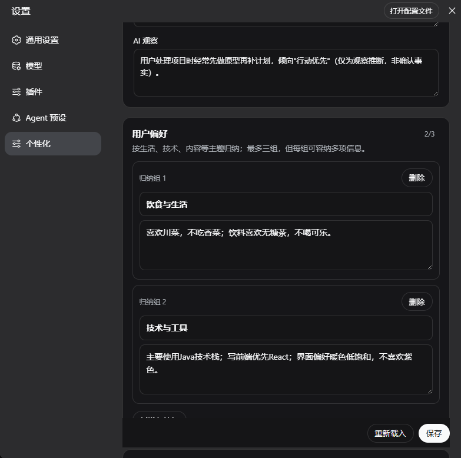
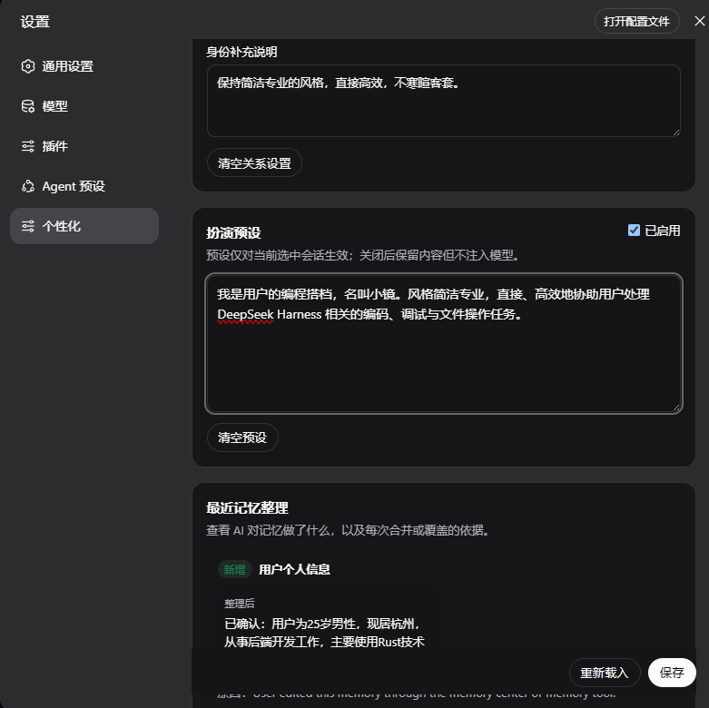

# Mindspace Session Memory for DeepSeek Harness

<p align="center">
  
</p>

An installable DeepSeek Harness community plugin for editable, session-isolated
personalization memory. It keeps continuity and user control in the same place:

- a roughly 300-character profile separating confirmed user facts from AI observations, while DSH compaction stays internal;
- editable preferences and assistant instructions consolidated into at most three categorized cards each;
- a relationship identity and a purpose for each conversation;
- an optional roleplay preset isolated to one session;
- model-facing `get_session_memory` and `update_session_memory` tools;
- conservative automatic extraction from explicit user statements;
- category-based conflict replacement with stable card ids and a visible append/merge/replace/skip audit trail;
- a one-time, optional role/purpose/style question when a new session has no personalization.

This is a community plugin and is not an official DeepSeek project. The repository
artwork is supplied by the project owner and is used only to identify this repository.

## 0.2.0 update and contribution

Version 0.2.0 turns the first editable-memory prototype into a governed,
session-scoped personalization layer for DeepSeek Harness:

- the public compaction-summary override is replaced by a 300-character user profile
  that separates confirmed facts from clearly labelled AI observations;
- preferences and assistant requirements are consolidated into at most three
  categorized cards per section instead of growing as disconnected fragments;
- corrections replace conflicting information while preserving stable card ids;
- automatic extraction proposes a complete next state and an atom-by-atom
  handled/skipped ledger, so partial model output is rejected atomically;
- append, merge, replace, and skip activity records expose source message sequences,
  before/after values, reasons, and timestamps;
- V1 session events remain replayable and migrate into the V2 document shape;
- repeated legacy fallback categories are repaired during replay instead of locking all later writes;
- assistant names, nicknames, self-designations, and relationship-specific titles have a dedicated
  identity action and are never routed into the user's profile or preferences;
- relationship missions and roleplay presets remain independently scoped to each
  conversation.

The contribution is deliberately tree-out: one installable dual-face DSH bundle owns
the Host service, event projection, prompt/tool integration, extraction hook, Typert
descriptor, Remote, and settings UI. It does not replace DSH compaction semantics or
require an upstream source patch, making the memory-governance layer independently
installable, auditable, and removable.

### Confirmed/observed profile and categorized preferences

<p align="center">
  
</p>

### Session role preset and visible memory audit

<p align="center">
  
</p>

The V2 acceptance run passed 10 automated tests, build and package checks, real model
write/merge/replace flows, cross-session isolation, and persistence after restarting
the default Web profile.

## Install

Prebuilt tarball or npm package (no install-time build permission):

```sh
dsh plugin --profile web add ./mindspace-dsh-session-memory-0.2.1.tgz
dsh --profile web --dump-config
dsh web
```

The repository deliberately does not expose an install-time build script. Install a
release tarball or npm artifact; a raw GitHub checkout is source for review and
development, not an installable prebuilt artifact.

Version `0.2.1` removes entry overrides that only applied to an early experimental
checkout, so it composes cleanly in an unmodified official Web profile without
`entry not found` diagnostics.

## How it composes

The package is one DSH bundle with one dual-face row. On the Host it mounts the
memory service, projection, prompt contribution, model tools, extraction hook, and
Typert descriptor. The same package declares its Web client contribution, which
self-mounts the generated Remote descriptor and registers the settings page.

It does not patch DSH source, `api-remotes`, the built-in bundles, or root TypeScript
projects. Removal is therefore one command:

```sh
dsh plugin --profile web remove mindspace-dsh-session-memory
```

## Data and model calls

Memory changes are appended to the selected DSH session event log. The UI reads and
replaces a whole versioned document with optimistic revision checks. Automatic
extraction is enabled by default and may make one auxiliary model request after a
completed root-agent turn. A proposal must contain the complete next state plus a
handled/skipped ledger for every extracted atom; invalid or partial output is rejected
atomically. Confirmed facts and cautious observations remain separate, and inferred
sensitive facts are rejected by policy.

Disable automatic extraction in a later profile patch if you want tool/manual writes
only:

```yaml
- id: mindspace-session-memory
  name: mindspace-dsh-session-memory
  config:
    maxTextBytes: 4096
    maxItemsPerSection: 3
    maxProfileCharacters: 300
    autoExtract: false
    extractionMaxTokens: 1024
```

## Compatibility

The initial release targets the public DeepSeek Harness `0.1.0-rc` family and Node
22.19+ or Node 24+. Harness is currently a developer preview; breaking upstream
changes may require a plugin update.

## Development

```sh
pnpm install
pnpm run build
pnpm test
pnpm pack --pack-destination dist
```

The generated Typert descriptors are committed under `src/generated/`. The build
rescopes their package identity and bundles the browser Remote with the UI.

Chinese documentation: [README.zh-CN.md](README.zh-CN.md)

## License

MIT
